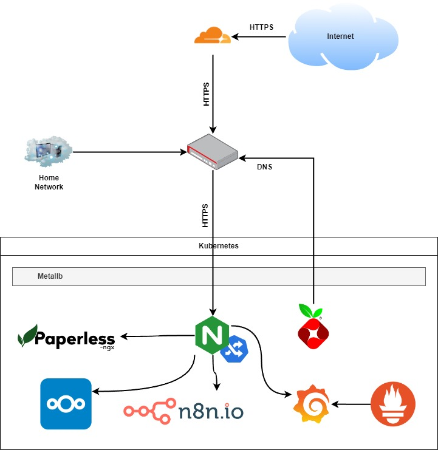

# HOMELAB

Here I keep all my home server configuration and workflows.



Currently I have a cluster of 4 raspberrypi compute modules on a board:

```
Listing labels for Node./pinode1:
 kubernetes.io/os=linux
 kubernetes.io/arch=arm64
 kubernetes.io/hostname=pinode1
 beta.kubernetes.io/os=linux
 beta.kubernetes.io/arch=arm64
 node-role.kubernetes.io/control-plane=true
 node-role.kubernetes.io/master=true
 turing-pi/DSI=true
 turing-pi/HDMI=true
 turing-pi/GPIO=true
 turing-pi/Mini-PCIe=true
Listing labels for Node./pinode2:
 kubernetes.io/os=linux
 kubernetes.io/arch=arm64
 kubernetes.io/hostname=pinode2
 beta.kubernetes.io/os=linux
 beta.kubernetes.io/arch=arm64
 turing-pi/Mini-PCIe=true
Listing labels for Node./pinode3:
 kubernetes.io/os=linux
 kubernetes.io/arch=arm64
 kubernetes.io/hostname=pinode3
 beta.kubernetes.io/os=linux
 beta.kubernetes.io/arch=arm64
 turing-pi/sata-3=true
Listing labels for Node./pinode4:
 kubernetes.io/os=linux
 kubernetes.io/arch=arm64
 kubernetes.io/hostname=pinode4
 beta.kubernetes.io/os=linux
 beta.kubernetes.io/arch=arm64
 turing-pi/usb-3=true
```
